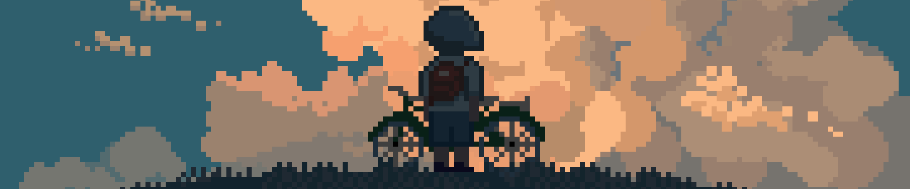

<h1 align="center">
  
  𝐇𝐞𝐥𝐥𝐨, it's Miguel!
  
</h1>

  

> I'm an enthusiastic data analyst in business strategy. My journey's 🚀 marked by a deep passion for innovation and entrepreneurship, tackling challenges that blend cutting-edge technology with business insights.

- 🏫 Currently learning **Python**, **R**, **SQL**, **Large-scale Computing**, **Optimization for BA** and **Machine Learning** at university.
- 🔭 Learning **mainframe technologies** and **scalable computation**.
- 🔢 Working on mastering statistical analysis techniques.

Thanks for visiting and I'd love to <a href="https://www.linkedin.com/in/migueldiazperezdejuan/">connect!</a> 🌟

 <h5 align="center">
   <i>⚡️I don’t trust people who don’t write SQL queries in uppercase⚡️</i>
  </h5>

---
 ## 🛠️Tools I use

  <!-- Icons for the requested technologies -->
  
  
  
  
  
  
  
  
  
  
  
  
  

## 🚀 Notable Projects

| 🔗 Project                                                                                 | Description                                     | Technologies               |
| ------------------------------------------------------------------------------------------ | ----------------------------------------------- | -------------------------- |
| 🔗 [**My Portfolio**](https://migueldiazpdj.github.io/)                                    | Personal Website Showcasing Projects and Skills | HTML, CSS, JavaScript, React      |
| 🔗 [**Multi Axis Regression for ITP Manufacturing**](https://github.com/migueldiazpdj/Multi-Axis-Regression-Approach-for-ITP-Aero-Manufacturing-Data) | Machine Learning for Broaching Optimization - ITP Aero | RStudio, ML Models |
| 🔗 [**Opt Algorithms for Rubies Challenge**](https://github.com/migueldiazpdj/Optimization-Algorithms-Put-to-the-Test--The-Complex-Rubies-Challenge)  | Comparing the performance    | RStudio, Optimization Algorithms |
| 🔗 [**Time Spent**](https://github.com/migueldiazpdj/Time-Spent)                           | Application to Track and Visualize Time Usage   | RStudio, Statistics |
| 🔗 [**Hackathon GDSC**](https://github.com/migueldiazpdj/HackathonGDSC)                    | Solutions and Analysis from Hackathon Projects  | Python, Model Prediction      |
| 🔗 [**PERT Analysis with Python**](https://github.com/migueldiazpdj/Pert-Analysis-with-Python) | PERT Chart Analysis for Project Management      | Python, Business Analytics           |
| 🔗 [**Farm Data Analysis**](https://github.com/migueldiazpdj/Farm-Data-Analysis)           | Analysis and Visualization of Farm Data         | Stata, Python, pystata    |

## Find me around the web 🌎:
- Sharing updates on ➪   
- Send me an email ➪   

### Show some ❤️ by starring ⭐ some of the repositories!

---

<pre>
 ██████╗ ██████╗ ██████╗ ███████╗       ██╗        ██████╗██████╗ ███████╗ █████╗ ████████╗███████╗
██╔════╝██╔═══██╗██╔══██╗██╔════╝       ██║       ██╔════╝██╔══██╗██╔════╝██╔══██╗╚══██╔══╝██╔════╝
██║     ██║   ██║██║  ██║█████╗      ████████╗    ██║     ██████╔╝█████╗  ███████║   ██║   █████╗  
██║     ██║   ██║██║  ██║██╔══╝      ██╔═██╔═╝    ██║     ██╔══██╗██╔══╝  ██╔══██║   ██║   ██╔══╝  
╚██████╗╚██████╔╝██████╔╝███████╗    ██████║      ╚██████╗██║  ██║███████╗██║  ██║   ██║   ███████╗
 ╚═════╝ ╚═════╝ ╚═════╝ ╚══════╝    ╚═════╝       ╚═════╝╚═╝  ╚═╝╚══════╝╚═╝  ╚═╝   ╚═╝   ╚══════╝
</pre>

<!--🦶FOOTER--> 

<!-- Horizontal line -->

 
 

